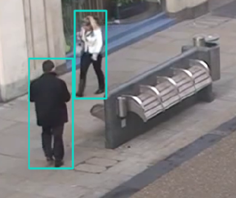
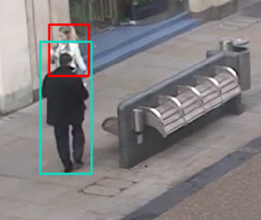
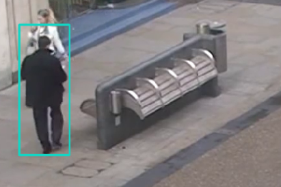
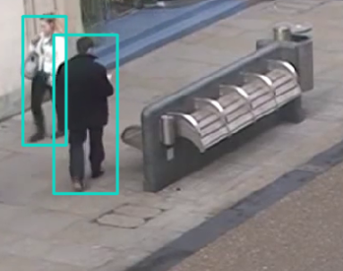

跟踪的时候，两个人路过时可能会出现的情况:

- 状态1
 
- 状态2
 
- 状态3
 
- 状态4
 

- 上图中浅色框为正常的高分框，但经过时就会出现`状态2`的情况，其中红色框为较低分框;
- 该红框会匹配之前的track, 但是当红框的人被完全遮挡且框消失了再出现(3 → 4)，则大概率不能够匹配回原id,
- 因为之后新出现的框是完整的所以新出现的浅色框可能与红框匹配不了, 导致新出的框换上了新ID;
- 如果不出现`状态2`, 按照`状态1`根据卡尔曼滤波更新的边框, 应该是能够与`状态4`重新出现的预测框匹配，从而还原id;

也就是说：
- 1 → 2 → 3 → 4，可能会切换id
- 1 → 3 → 4，能够保留id

解决(缓解)方法:
- 提高检测器置信度阈值，避免`状态2`的情况发生;
- 根据置信度调整iou匹配的相似度(bytetrack中的`fuse_score`操作);
